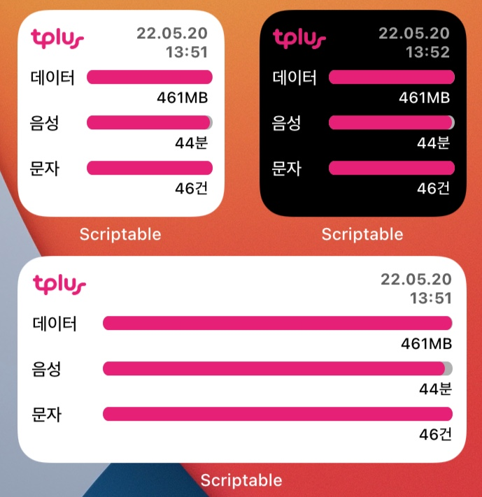

# tplus Usage Widget for iOS/iPadOS
티플러스 (SKT망) 통신사 사용량 조회 위젯 (Scriptable)

[위젯 다운로드 (최신)](https://github.com/nerious2/tplus-usage-widget-for-ios/releases/latest)

## 소개

- iOS/iPadOS 14 이상을 지원하는 Apple 기기에서 사용 가능한 [Scriptable](https://apps.apple.com/kr/app/scriptable/id1405459188) 위젯입니다.
- [티플러스](https://www.tplusmobile.com/) 웹 사이트의 인증된 계정이 필요합니다.
- 티플러스 (SKT망) 사용량(데이터, 음성, 문자)을 조회하여 위젯 형태로 표시합니다.
- 해당 위젯은 티플러스 SKT망 후불 요금제 사용자만 이용이 가능합니다. (선불 요금제는 테스트하지 못함)
- 대표로 설정된 번호 1개에 대해서만 사용량 조회가 가능합니다.
- 과도한 데이터 사용을 막기 위해, 자동으로 새로고침하는 최소 주기(캐시 보관 시간)를 설정할 수 있습니다.
- 다크모드 테마를 지원하며, 다크모드 설정과 상관 없이 테마를 고정할 수도 있습니다.
- 스크립트 설정 메뉴를 지원합니다. **초기 설정을 위해 처음 1회는 반드시 스크립트 파일을 Scriptable 앱 내에서 실행하시기 바랍니다.**

## 유의사항

- **사용량 조회는 실시간 정보가 아니므로 참고용으로만 이용하시기 바랍니다.** 본 위젯을 사용함에 있어 과도한 추가 요금 발생 등의 문제에 대한 책임은 사용자에게 있습니다.
- 자동 새로고침 최소 주기를 짦게 설정할 경우, Wi-Fi가 아닌 환경에서 데이터 사용량이 증가할 수 있습니다. (`설정 - 셀룰러 - 이번 청구 기간`에서 Scriptable 사용량 확인 가능)
- **자동 새로고침 최소 주기는 위젯이 자동으로 새로고침하는 정확한 주기를 설정하는 것이 아닙니다.** 위젯이 새로고침되는 주기는 iOS의 정책에 따라 자동으로 결정됩니다.
- 티플러스 서버에 접속하기 위해 계정의 ID와 Password를 json 파일로 Scriptable Document (iCloud Drive를 사용하는 경우에는 iCloud에 보관됨) 경로에 저장합니다. 평문으로 저장하기 때문에, 가급적이면 비밀번호를 다른 사이트와 중복되지 않는 것으로 설정하시기 바랍니다. **ID와 Password는 tplusmobile.com 도메인을 제외한 그 어떤 곳에도 사용하지도, 수집하지도 않습니다.** 스크립트가 불필요하여 삭제하고자 하는 경우, 스크립트 설정 메뉴에서 사용자 정보 삭제 기능을 이용하시기 바랍니다.
- 해당 스크립트는 사용자의 설정에 따라 자동으로 스크립트를 업데이트하는 기능을 제공합니다.
